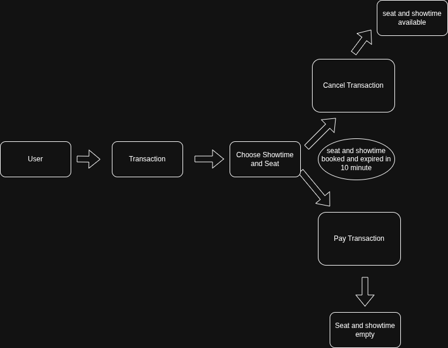

# Cinema App

Nama: M. Dhoni Zahrul Arifin Malik

link postman **(regularly update)**: https://backend-tes.postman.co/workspace/backend-tes-Workspace~32a46daa-e200-4e8d-8be9-755dea3261e7/collection/21392439-2ad301b1-0a44-4566-bbb9-6b7edd875ad9?action=share&creator=21392439

<!-- atau postman json: https://github.com/doniarifin/cinema-app/releases/tag/postman -->

## Diagram



## Quick Start

### 1. Rename/copy .env_copy to .env

```
cp .env_copy .env
```

setup your env

### 2. Install depedencies and run the app

- install depedencies

```
go mod tidy
```

- run the app, entry point in `cmd` folder/directory.

```
go run main.go
```
